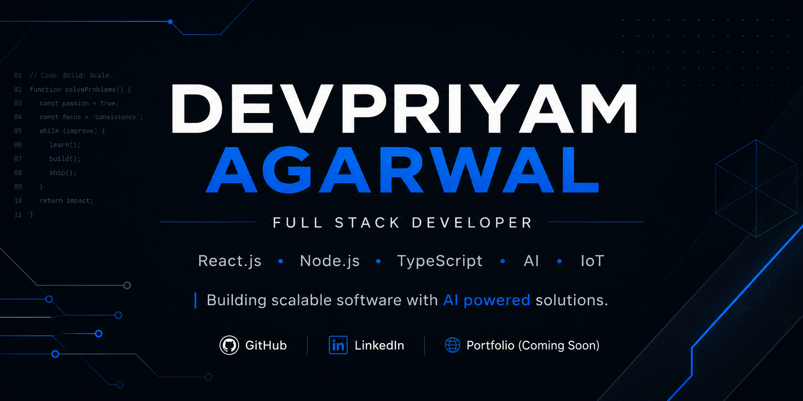

  

<h1 align="center">Hi 👋 I'm Devpriyam Agarwal</h1>

<h3 align="center">Full Stack Developer | React.js • Node.js • TypeScript • AI Integrations</h3>

I build scalable web applications, AI powered tools and backend systems with a focus on clean architecture and great user experience.

---

## 👨‍💻 About Me

- 🚀 Full Stack Developer passionate about building modern web applications.
- 🤖 Exploring AI Engineering, LLMs and intelligent automation.
- ⚙️ Interested in scalable backend systems and REST APIs.
- 📚 Solving Data Structures & Algorithms to strengthen problem solving.
- 🎯 Actively looking to build impactful software and grow as a Software Engineer.

---

## </> Tech Stack

| Category | Technologies |
|----------|--------------|
| **Languages** |      |
| **Frontend** |    |
| **Backend** |      |
| **Databases** |    |
| **Cloud & DevOps** |       |
| **AI / LLM** |   |
| **Tools** |    |
| **Core Concepts** |    |

---

## 🚀 Featured Projects

### 🤖 AI Productivity App
AI powered productivity platform featuring chat, summarization and intelligent workflows.

### 📋 KanFlow
Modern Kanban application with drag and drop task management.

### ☁️ SkySense Weather App
Real time weather dashboard with responsive UI and live API integration.

### ⚡ IoT Energy Monitoring System
ESP32 based smart energy monitoring system with real time analytics.

---

## 📈 GitHub Stats

  

  

  

---

## 📫 Connect With Me

- 💼 LinkedIn: https://www.linkedin.com/in/devpriyamagarwal
- 📧 Email: agarwaldevpriyam02@gmail.com

---

⭐ Thanks for visiting my profile! Feel free to explore my repositories and connect with me.

